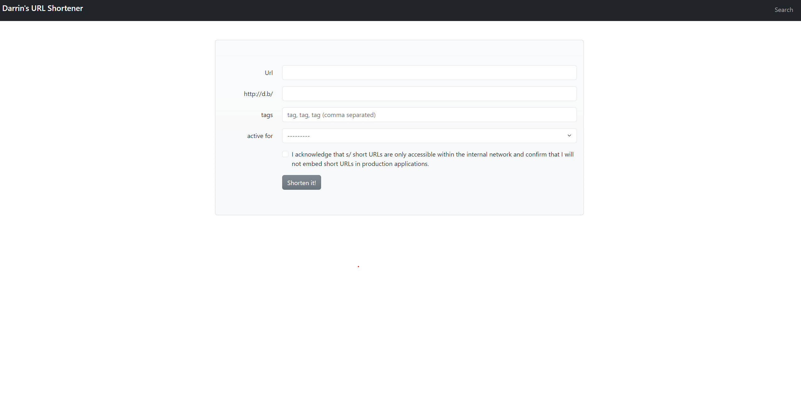
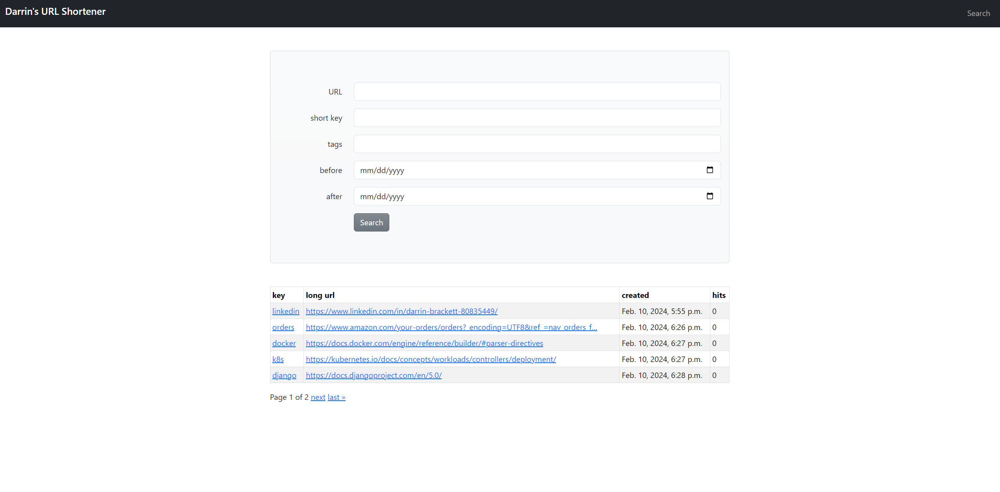
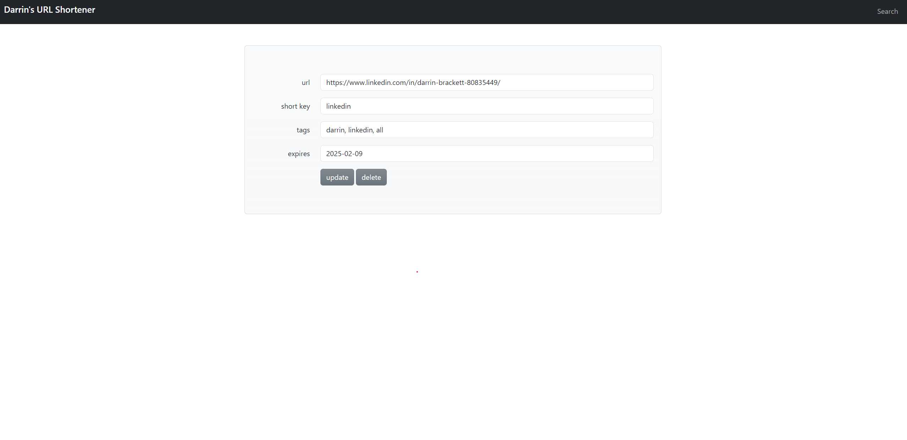

# Description
The purpose of this project is to provide a URL shortener service allowing the creation of the shorted possible URLs. It's effortless to remember short URL's using well known words or acronyms and often times I successfully guess at shorteners that others have created when trying to find a service. 

# Usage
I have a demo build of this application on dockerhub. There is a sqlite database in the container which is initalized with sample data
every time the container starts and is lost every time the container terminates. 

## Run on Docker

Pull the image and map localhost port 80 to container port 8000.

    - docker pull docker.io/dbrac/url_shortener:1.0
    - docker run -d -p 80:8000 docker.io/dbrac/url_shortener:1.0 

### Create and use a shortener
Open your web browser

    - Go to http://localhost
    - Create a shortner
    - Go to http://localhost/<your_shortener>

### Make it shorter

You can make this shorter with an entry in your hosts file. Add an entry like this to your hosts file: 

    - 127.0.0.1 d.b

I used d.b in the application but you can make it even shorter like this:

    - 127.0.0.1 s

From your browswer, go to http://d.b/<your_shortener>

### Search Shorteners

Search for shorteners from the top right of the home page. You can't search by date alone, your search must include the url, short key or tag. For demonstration purpose, all sample shorteners have an "all" tag. Enter "all" into the tags field and search.

### Update Shortener

From the search results, you can select the shortener name which will load the update view where you can update the URL of the shortener and its tags.

### Run on Kubernetes

Use the kubernetes.yaml to deploy onto kubernetes. Make sure to adjust the ingress hostname to match your environment. Check out this scripted Kubernetes cluster build if you are interested in building your own cluster: https://github.com/dbrac/k8s-cluster-build

    kubectl apply -f kubernetes.yaml

# UI Preview

